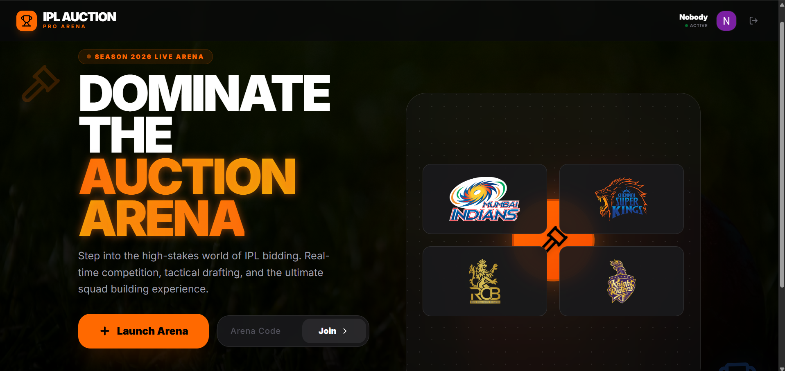
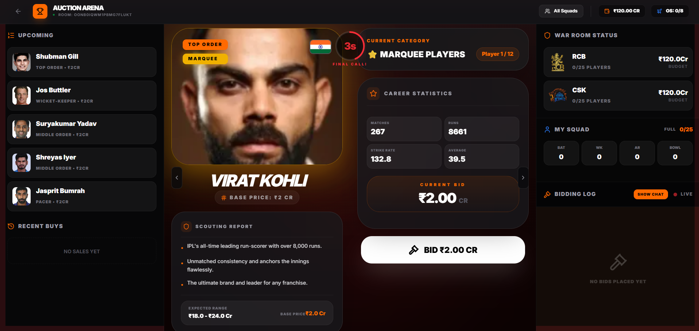
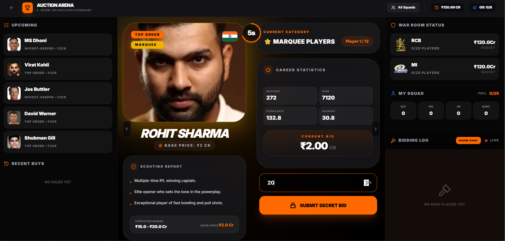
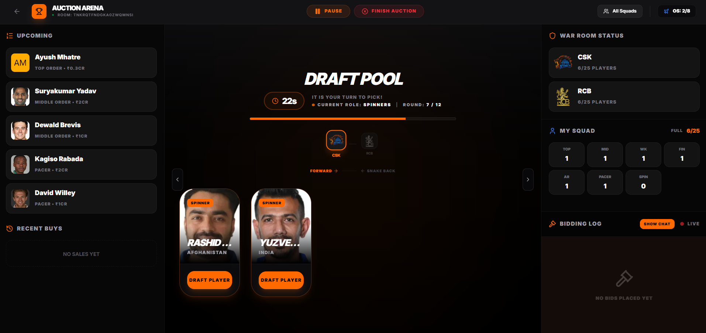
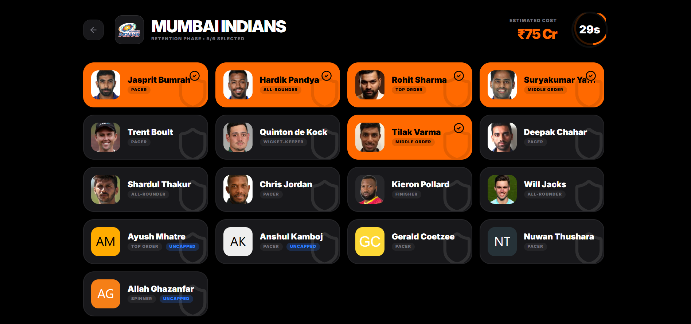
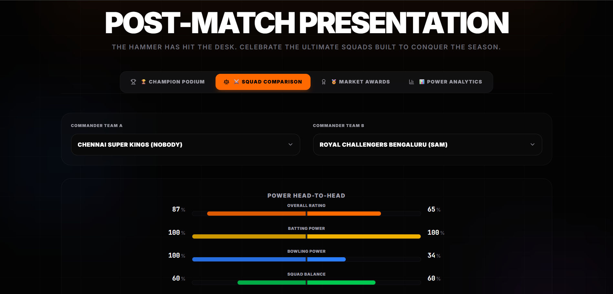

# 🏏 IPL Auction Pro

A modern, real-time **multiplayer IPL Auction Simulator** that recreates the excitement of a professional cricket auction. Create private auction rooms, invite friends, compete in multiple auction formats, build balanced squads, and review your team's performance through interactive analytics.

## 🌐 Live Demo

**Live Application:** https://ipl-auction-pro-v1.onrender.com/

---

## ✨ Features

* ⚡ Real-time multiplayer auction using Socket.io
* 👥 Create and join private auction rooms
* 🏏 Curated database of **127 IPL players**
* 💰 Live bidding with synchronized budgets
* 📊 Real-time squad and budget tracking
* 🤖 AI-powered post-auction analysis
* 📈 Interactive squad strength and budget graphs
* 🔐 Google Authentication with Firebase
* ☁️ Firebase Firestore for persistent room data
* 📱 Responsive UI with smooth animations

---

# 🎮 Auction Modes

### 🔸 Open Auction

Classic live IPL auction where franchises compete by continuously increasing bids until the timer expires.

### 🔸 Blind Auction

Managers submit hidden bids. The highest bid wins without revealing competitors' offers.

### 🔸 Draft Mode

A structured snake draft with dedicated phases for:

* Wicketkeepers
* Batters
* All-rounders
* Bowlers

The draft automatically manages turn order, round transitions, and player allocation.

### 🔸 Mega Auction

Inspired by IPL Mega Auctions with squad retentions, larger purses and long-form squad building.

---

# 🤖 AI Features

* Pre-generated player scouting reports
* AI-assisted post-auction squad reviews
* Team balance analysis
* Squad strength insights

---

# 🛠 Tech Stack

### Frontend

* React 19
* TypeScript
* Vite
* Tailwind CSS v4
* Framer Motion
* Recharts
* Lucide React

### Backend

* Node.js
* Express
* Socket.io

### Database & Authentication

* Firebase Authentication
* Firebase Firestore

### AI

* Google Gemini API

---

# 📸 Screenshots

## Home



## Lobby


## Open Auction



## Blind Auction



## Draft Mode



## Mega Auction



## Results



---

# ⚙️ Installation

Clone the repository:

```bash
git clone https://github.com/nobody294469/IPL-Auction-Pro-v1.git
cd IPL-Auction-Pro-v1
```

Install dependencies:

```bash
npm install
```

Run the development server:

```bash
npm run dev
```

Build the project:

```bash
npm run build
```

Run the production server:

```bash
npm start
```

---

# 🔑 Environment Variables

Create a `.env` file in the project root:

```env
GEMINI_API_KEY=your_gemini_api_key
APP_URL=http://localhost:3000
```

---

# 🚀 Deployment

The project is deployed on **Render**.

Build Command:

```bash
npm run build
```

Start Command:

```bash
npm start
```

---

# 📂 Project Structure

```
src/
├── components/
├── data/
├── hooks/
├── services/
├── utils/
├── App.tsx
├── main.tsx

server.ts
package.json
```

---

# 🔮 Future Improvements

* Custom player database import
* Auction history and statistics
* Tournament mode
* Custom franchises
* Player value prediction
* Voice auctioneer mode

---

# 👨‍💻 Author

**Sammyag Solanki**

---

## ⭐ Support

If you found this project interesting, consider giving the repository a ⭐ on GitHub.
